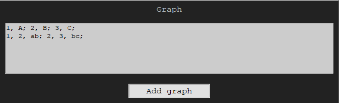

# Program do stosowania transformacji grafowych bazując na podejściu algorytmicznym
Realizowany w ramach przedmiotu Transformacje i Algorytmy Grafowe na kierunku Informatyka na AGH

Program umożliwa zapisywanie grafów oraz produkcji w postaci podejścia algorytmicznego, a także ich stosowanie. 
Jest możliwe podanie kilku grafów, a następnie wybór do którego z nich dana produkcja ma zostać zastosowana.
Po zastosowaniu niezamierzonej produkcji istnieje możliwość powrotu grafu do poprzedniego stanu (**REVERSE**).

Użyte technologie:
- całość programu napisana w języku *Python*
- do wizualizacji grafu użyty został program *Graphviz* (przy użyciu jego API w Pythonie)
- interfejs graficzny stworzony w *Tkinter*

---
## Uruchamianie
Do uruchomienia programu potrzebny jest [interpreter Pythona](https://www.python.org/downloads/), [Graphviz](https://graphviz.org/download/), jego pakiet do integracji z Pythonem, który można pobrać przy pomocy narzędzia *pip*, oraz pakiet *tkinter*
```
[user@$host ~]$ pip3 install graphviz
[user@$host ~]$ pip3 install tk
```
Program można uruchomić przez komendę
```
[user@$host ~]$ python3 filepath
```
gdzie _filepath_ to ścieżka do pliku gui.py


## Dodawanie grafu (**Add graph**):
```
index_wierzchołka_1, etykieta_wierzchołka_1; index_wierzchołka_2, etykieta_wierzchołka_2;
index_wierzchołka_wyjścia_krawędzi_1, index_wierzchołka_wejścia_krawędzi_1, etykieta_krawędzi_1;
```

Przykład:
```
1, A; 2, B; 3, C;
1, 2, ab; 2, 3, bc;
```



## Dodawanie produkcji (**Add production**):
- Lewa strona produkcji: analogicznie jak graf
- Prawa strona produkcji: analogicznie jak graf
- Transformacja osadzenia:
```
krawędź_do_usunięcia, kierunek_od_LSP, index_z_LSP; etykieta_wierzchołka_z_PSP, etykieta_wierzchołka_z_RG, etykieta_nowej_krawędzi, kierunek_krawędzi;
```

Przykład (transformacji osadzenia):
```
s, out, 1; A, N, s, out; M, N, -a, in;
ai, out, 1; A, I, ai, out; M, I, -c, in;
```


## Stosowanie produkcji (**Apply**):
- pole po lewej stronie :
numer_produkcji (spośród listowanych po lewej stronie okna)
- pole po prawej stronie:
```
index_wierzchołka_1_z_LSP index_wierzchołka_1_z_grafu index_wierzchołka_2_z_LSP index_wierzchołka_2_z_grafu
```

Przykład:
```
1. pole:
0
2. pole:
1 1
```

*LSP - lewa strona produkcji, PSP - prawa strona produkcji, RG - reszta grafu*

After adding graph no '0' and applying production '0' on vertex '1'


After applying production '1' twice on vertex '1'


## Autorzy i podział ról
- Nikodem Korohoda - parsowanie notacji, przechowywanie produkcji, wizualizacja grafu, organizacja projektu
- Mateusz Więcek - przechowywanie grafów oraz produkcji
- Tobasz Szulc - stosowanie transformacji
- Jakub Radek - stosowanie transformacji
- Damian Tworek - parsowanie notacji, refactoring kodu
- Łukasz Wala - interfejs graficzny, wizualizacja grafu
